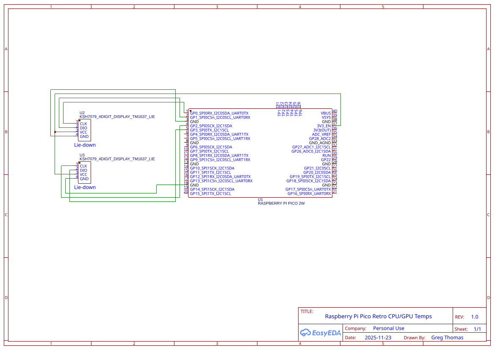

# RPI Pico PC Temperature Display

This app can be used to display the temperature of your PCs CPU and GPU a couple of TM1637 displays and an RPI pico.
If you already own a soldering iron and some scraps of cable you cand build this thing for around 15 bucks.

## Pico Wiring Diagram

### Parts List

  * HW069 / TM1637 4 digit 7 part display
  * Rasberry Pi Pico

### Wiring Diagram

## Printable Case

STLs for a two part case live in [`case/`](case):

  * `main-housing.stl` — the shell the displays sit in. 60 × 56 × 22 mm.
  * `base-plate.stl` — the back that closes it up. 57.4 × 53.4 × 13.4 mm.

**These files are in metres, not millimetres.** Most slicers assume millimetres, so on import
the case will show up as a 0.06 mm speck. Scale it by 1000 (or set the import units to metres)
and it will come out the right size. Both parts fit on any common printer bed once scaled.

## Installation 

Grab the latest zip from the [Releases page](https://github.com/greg162/Retro-CPU-GPU-temp-display/releases)
and unzip it somewhere on your PC. It contains `TempSensorApp.exe`, the two DLLs
it needs, and `main.py` for the Pico.

  * Download the UF2 file for the Pico from here: https://www.raspberrypi.com/documentation/microcontrollers/micropython.html
  * Download and install Thonny: https://thonny.org/
  * Plug your RPI Pico into your PC while holding down the BOOTSEL button.
  * Copy the UF2 image into your PICO device in using file explorer (it should be called RPI-RP2).
      - After doing this the device will restart.
  * Start Thonny.
     - Copy and paste script in `main.py` into the code editor.
     - Press the save button, a prompt should pop up asking you where you want to save the file. Save it to the Pico using the name `main.py`
  * Run the TempSensorApp.exe file. **Right click it and pick "Run as administrator".**
    - Without administrator rights the app cannot load the driver it uses to read the CPU,
      so the CPU display stays blank while the GPU one keeps working. If that's what you're
      seeing, this is almost always why.
    - It runs as a system tray icon rather than a window. The icon shows the CPU
      temperature and turns amber then red as things heat up. Right click it for both readings.
    - If you've setup everything successfully, the you should see the temperatures pop up on each display.

## Starting it automatically

The app doesn't install itself or start on its own. Because it has to run as administrator,
dropping a shortcut in the Startup folder doesn't work — Windows blocks the elevation and you
get a UAC prompt on every boot instead. Use Task Scheduler:

  * Open Task Scheduler and choose **Create Task** (not *Create Basic Task*, which has no
    option for running elevated).
  * On the **General** tab, name it something like `TempSensorApp` and tick
    **Run with highest privileges**.
  * On the **Triggers** tab, add a trigger with **Begin the task: At log on**.
  * On the **Actions** tab, add a **Start a program** action pointing at wherever you unzipped
    `TempSensorApp.exe`.
  * On the **Conditions** tab, untick **Start the task only if the computer is on AC power**
    if you're on a laptop and want it running on battery too.

Ticking "Run with highest privileges" is what lets it start silently without a UAC prompt.

One thing to watch: the Pico has to be plugged in before the app starts, so if you're booting
with the Pico connected this is fine, but if you plug it in later you'll need to restart the app.

Building the exe yourself is covered in [TempSensorApp/readme.md](https://github.com/greg162/Retro-CPU-GPU-temp-display/blob/master/TempSensorApp/readme.md).

